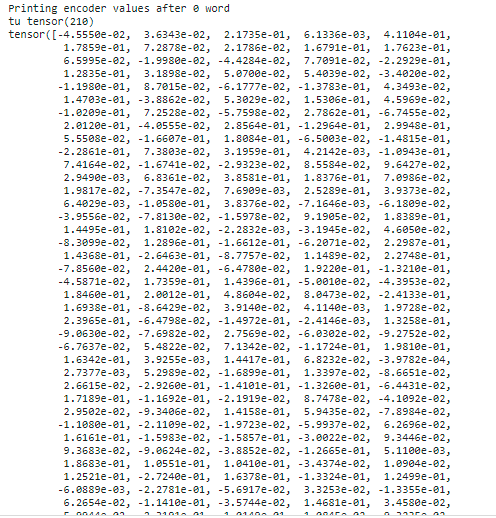
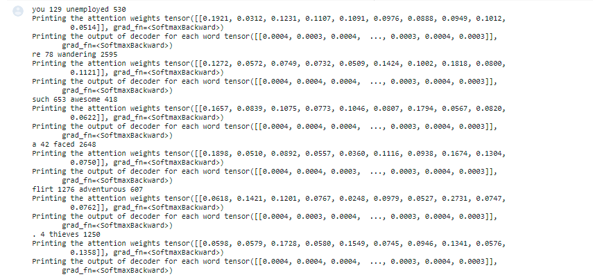
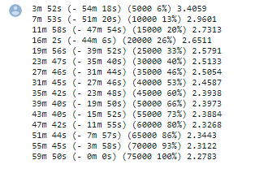
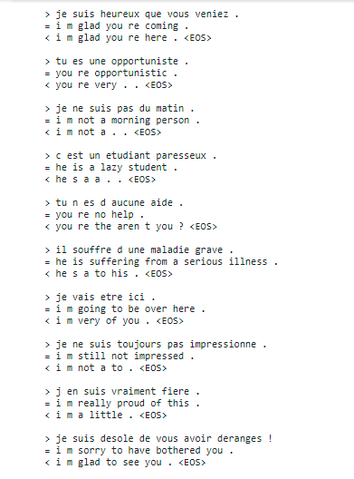

## Session 11 - Seq2Seq Attention Networks ##

Submitted as a **group assignment** by 
- Smruthi SR
- Debashish Sarangi
- Pavithra Solai
- Anirban Mukherjee

**Objective:** Creating a Seq2Seq model with attention for French to English Translation using LSTM and here we will be manually checking the output of encoder and decoder at each time step

The following attention architure is used 


### Implementation of the above architecture manually for one sample ###
1. Encoder:

```
embedding = nn.Embedding(input_size, hidden_size).to(device)
lstm = nn.LSTM(input_size=hidden_size, hidden_size=hidden_size, num_layers=1).to(device)

encoder_outputs = torch.zeros(MAX_LENGTH, 256, device=device)
encoder_hidden = torch.zeros(1, 1, 256, device=device)
encoder_cell_state = torch.zeros(1, 1, 256, device=device)

for i in range(input_tensor.size()[0]):
  embedded_input = embedding(input_tensor[i].view(-1, 1))
  output, (encoder_hidden,encoder_cell_state) = lstm(embedded_input, (encoder_hidden,encoder_cell_state))
  #encoder_outputs[i] += output[0,0]
  if(i!=(input_tensor.size()[0])-1):
    print(f'Printing encoder values after {i} word')
    print(input_sentence.split(" ")[i], input_tensor[i])
    print(encoder_hidden[0,0])
  encoder_outputs[i] += encoder_hidden[0,0]
  
```

For example if this is a input sentence "tu es un de ces dragueurs !". 
* For Each word in this sentence, respective index is fetched from the entire data corpus. 
* These word indexes are passed one by one i.e say suppose word tu index is 12 that is passed to embedding layer by changing it's shape using "view(-1,1)"to have [batch_size,sen_len,emb_dim] and this is repeated for every word. This is done to make our network to understand we are sending a batch of samples instead of one word.
* The output of embedding layer is passed to LSTM layer to obtain hidden vectors (encoder_hidden) of word one by one.
* The hidden vectors of each words are appened one by one (encoder_outputs[i] += encoder_hidden[0,0]).
* The encoder_outputs contains hidden vectors of all the words and this is the output of the encoder is later used in attention block.
* For loop is used to apply above steps on one word at a time. 




2. Decoder with Attention:

```
embedding = nn.Embedding(output_size, 256).to(device)
attn_weight_layer = nn.Linear(256 * 2, 10).to(device)
input_to_lstm_layer = nn.Linear(256 * 2, 256).to(device)
lstm = nn.LSTM(256, 256).to(device)
output_word_layer = nn.Linear(256, output_lang.n_words).to(device)


decoder_input = torch.tensor([[SOS_token]], device=device)

```

```
for i in range(6):
  decoder_input = torch.tensor([[target_indices[i]]], device=device)
  decoder_hidden = encoder_hidden
  output_size = output_lang.n_words
  embedded = embedding(decoder_input)
  attn_weights = attn_weight_layer(torch.cat((embedded[0], decoder_hidden[0]), 1))
  attn_weights = F.softmax(attn_weights, dim = 1)
  attn_applied = torch.bmm(attn_weights.unsqueeze(0), encoder_outputs.unsqueeze(0))
  input_to_lstm = input_to_lstm_layer(torch.cat((embedded[0], attn_applied[0]), 1))
  input_to_lstm = input_to_lstm.unsqueeze(0)
  output, (decoder_hidden,decoder_cell) = lstm(input_to_lstm, (decoder_hidden,decoder_hidden))
  #output = F.relu(output)
  output = F.relu(decoder_hidden)
  output = F.softmax(output_word_layer(output[0]), dim = 1)
  top_value, top_index = output.data.topk(1)
  print(target_sentence.split(" ")[i], target_indices[i], output_lang.index2word[top_index.item()], top_index.item() )
  print(f'Printing the attention weights {attn_weights}')
  print(f'Printing the output of decoder for each word {output}')

```

* For the first time, SOS token is passed as a input to decoder and in subsequent steps predicted output is used. If teacher forcing is applied then actual target word from the  sentence is sent to decoder while training.
* For the first time, the last hidden cell of the encoder is passed to decoder hidden state and in subsequent steps decoder hidden state is passed.
* Input to decoder is passed through decoder's embedding layer.
* The attention weights are obtained by passing output from embedding layer and decoder hidden state to Fully connected or linear layer.
* These attention weights are mulplited with encoders output vectors using batch matric multiplication (this is nothing but what we saw in Encoder section [encoder_outputs]) to obtain weighted attention weights. Here softmax function is applied on output of FC layer to obatined the weights for attention weights. 
* The decoder's input and weighted attention weights are passed through another FC or liner layer by concatinating, to identify for which part of encoder hidden states, more importance to be given so that decoder predicts the right word.
* Finally output from previous step is passed through LSTM layer which is then sent to anoth FC/liner layer get predicted output language words.
* For loop here apply all the above steps for one word at a time and it stops after EOS token.

For the input sentence "tu es un de ces dragueurs !". The actual target sentence is "you re such a flirt"

Below screen shot shows how each of the words from target sentence are predicted from the DecoderAttention steps (Basically output from above for loop)
  



###  Model Training logs ###

The above mentioned codes are combined into Encoder and AttentionDecoder classes to run on entire dataset and passed through training iteration function
with hidden embedding dimention of 256 and a drop out of 0.1 

We trained for 70k iterations 



Observations : The final loss of 2.27 is observed which is more than what we obsevered using GRU i.e 0.05. Our assumption is that GRU works better than LSTM, but need to perform further experiements to confirm the same

### Sample Evalutaions ### 


