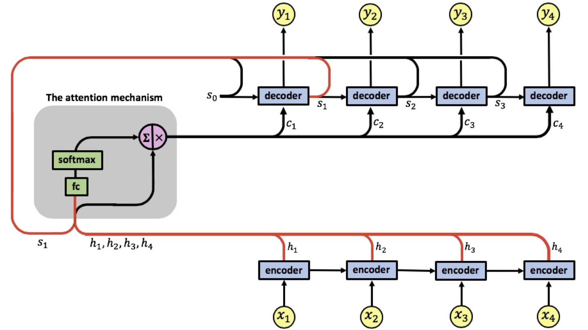

## Session 11 - Seq2Seq Attention Networks ##

Submitted as a **group assignment** by 
- Smruthi SR
- Debashish Sarangi
- Pavithra Solai
- Anirban Mukherjee

**Objective:** Creating a Seq2Seq model with attention for French to English Translation using LSTM and here we will be manually checking the output of encoder and decoder at each time step

The following attention architure is used 



### Implementation of the above architecture manually for one sample ###
1. Encoder:

```
encoder_outputs = torch.zeros(MAX_LENGTH, 256, device=device)
encoder_hidden = torch.zeros(1, 1, 256, device=device)
encoder_cell_state = torch.zeros(1, 1, 256, device=device)

for i in range(input_tensor.size()[0]):
  embedded_input = embedding(input_tensor[i].view(-1, 1))
  output, (encoder_hidden,encoder_cell_state) = lstm(embedded_input, (encoder_hidden,encoder_cell_state))
  #encoder_outputs[i] += output[0,0]
  if(i!=(input_tensor.size()[0])-1):
    print(f'Printing encoder values after {i} word')
    print(input_sentence.split(" ")[i], input_tensor[i])
    print(encoder_hidden[0,0])
  encoder_outputs[i] += encoder_hidden[0,0]
  
```

For example if this is a input sentence "tu es un de ces dragueurs !". 
* Each word index from this sentence is fetched from the entire data corpus. 
* These word indexes are passed one by one i.e say suppose word tu index is 12 that is passed to embedding layer by changing it's shape using "view(-1,1)"to have [batch_size,sen_len,emb_dim] and this is repeated for every word. This is done to make our network to understand we are sending a batch of samples instead of one word
* The output of embedding layer is passed to LSTM layer to obtain hidden vectors (encoder_hidden) of word one by one
* The hidden vectors of each words are appened one by one (encoder_outputs[i] += encoder_hidden[0,0])
* The encoder_outputs contains hidden vectors of all the words and this is the output of the encoder is later used in attention block
* For loop is used to apply above steps on one word at a time 


2. Encoder:


