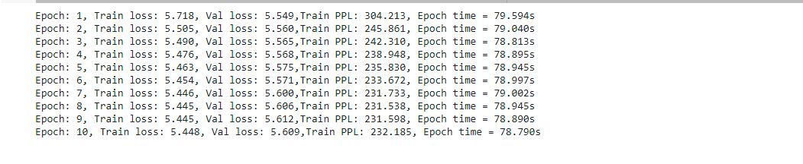

## Session 12 - Machine Translation using Trasformers ##

Submitted as a **group assignment** by 
- Smruthi SR
- Debashish Sarangi
- Pavithra Solai
- Anirban Mukherjee

### **Objective:** Creating a Transformer model for translating sentences from German to English from scratch ###

### Data set used : Multi30k ###

### Model Training logs ###

### Model performance on Test set ### 

