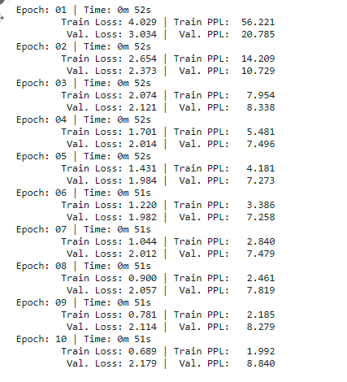

## Session 13 - Attention is all you need (AIAYN) ##

Submitted as a **group assignment** by 
- Smruthi SR
- Debashish Sarangi
- Pavithra Solai
- Anirban Mukherjee

### **Objective:** Creating a Transformer model for translating sentences from German to English from scratch (by replacing the legacy torch code to modren way in the shared code) ###


### Data set used : Multi30k ###

### Model Training logs ###




### Evalutaion ### 


### Sample Translations ### 

``` 
German sentence = Der Teenager springt mit seinem Fahrrad über den Hügel.

English sentence = The teen jumps the hill with his bicycle.

predicted English sentence = A female gymnast is jumping over the crest of his favorite tricycle . <eos> 

-----------------------------------------------------------------------------------------------------------------------
German sentence = Eine Gruppe von Leuten sitzt im Freien um einen kleinen, kurzen Tisch.

English sentence = A group of people sit outdoors around a small, short table.

predicted English sentence = A bridesmaid in a salmon - sleeved shirt sits around a small scoop . <eos> 

-----------------------------------------------------------------------------------------------------------------------
German sentence = Menschen an der Seitenlinie bei einem Fußballspiel.

English sentence = People on the sideline of a soccer match.

predicted English sentence = Local villagers are placing a turkey on a chimney . <eos> 

-----------------------------------------------------------------------------------------------------------------------
German sentence = Eine Frau spielt im Park mit zwei kleinen Jungen.

English sentence = A woman playing with two young boys at a park

predicted English sentence = A female swimmer playing with a small snowball 's bear . <eos> 

-----------------------------------------------------------------------------------------------------------------------
German sentence = Eine Straße neben einem interessanten Ort mit vielen Säulen.

English sentence = A road next to an interesting place with lots of pillars.

predicted English sentence = A closeup shot of a fruit truck with many yarn . <eos> 

-----------------------------------------------------------------------------------------------------------------------
German sentence = Der gelbe Hund trägt einen Stock übers Wasser.

English sentence = The yellow dog is carrying a stick by water.

predicted English sentence = An yellow cowgirl is carrying a pancake high necklace . <eos> 

-----------------------------------------------------------------------------------------------------------------------
German sentence = Eine Frau hält eine kleine weiße Statue.

English sentence = A woman is holding a small white statue.

predicted English sentence = A butcher holds a small white Popsicle . <eos> 

-----------------------------------------------------------------------------------------------------------------------
German sentence = Ein Arbeiter mit Werkzeugkiste kniet neben zwei Frauen.

English sentence = A male worker with his tool box is kneeling next to two women.

predicted English sentence = A tri - haired female driver kneels next to two pairs of broken plant . <eos> 

-----------------------------------------------------------------------------------------------------------------------
German sentence = Das ist eine Gruppe von Leuten, die auf einem Event herumstehen.

English sentence = This is a group of people standing around at some sort of event.

predicted English sentence = A very elaborate a cowgirl hat is standing out a freshly barbecued spatula on a freshly mown lawn . <eos> 

-----------------------------------------------------------------------------------------------------------------------
German sentence = Ein Kind geht auf dem Gehsteig und trägt ein paar amerikanische Flaggen.

English sentence = A kid is walking down the sidewalk with a few American flags.

predicted English sentence = A kid is walking a mustang on the top of some American an American sandwich . <eos> 

-----------------------------------------------------------------------------------------------------------------------
```
	
