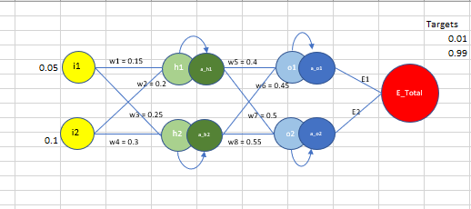
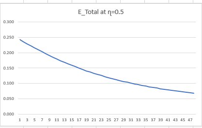

The Excel in this repo contains an example of simple neural network trained by hand (solving a equations for forward and backword propagation)

Description of training a NN steps are as below:

Above image is a simple neural network with input layer, one hidden layer and an output layer consisting of two nodes in each layer. 

Input layer with two nodes are connected to two nodes of the hidden layer with randomly initialized weights w1,w3,w2,w4 respectively
Hidden layer nodes are connected to output layer nodes with randomly initialized weights w5,w7,w6,w8 respectively
There are two nodes in the output layer, each of them produce small errors called E1,E2. 
The final accumulated error i.e E_Total is calculated by adding E1 and E2 

For the initial pass, 
Input to the hidden layer nodes are summation of input node's value multiplied by their respective weights (i.e h1=w1*i1+w2*i2 and h2=w3*i1+w4*i2)
the same is later passed to an activation function (here sigmoid is used) (i.e a_h1 = σ(h1)=1/(1+exp(-h1)), a_h2 = σ(h2)=1/(1+exp(-h2)))

The output of hidden layer with the respective weights are passed as input to output layer nodes and then multiplied with activation(sigmoid)function to get final output values.
(i.e o1 = w5 * a_h1 + w6 *a_h2, o2 = w7 *a_h1 + w8 * a_h2 then a_o1 = σ(o1), a_o2 = σ(o2))

The error here referred as loss. As we have two nodes in the output layer, two error values E1 and E2 are computed and then added together to get E_Total

**This entire process is called as forward propagation**

After the first pass, from w1 to w8 weights needs to be updated.

Initially w5 to w8 weights are updated followed by w1 to w4.

Note that weights at the output layer i.e w5 to w8 are independent of each other. 
Hence while solving the equation to obtain gradients for respective weights, other weights will be constant.

Whereas the weights at hidden layers i.e w1 to w4 are interconnected. 
For an instance, in the above image to reach to w1 from E1 there are two possible routes: 
o1->w5->h1->w1 
o2->w7->h1->w1

Similarly, to reach to w2 from E1:
o1->w7->h2->w2 
o2->w8->h2->w2

So, while solving an equation to obtain gradients for respective weights, the other weights must be taken into consideration.

The new weights are obtained by old weights - learning rate * gradient.

**Above mentioned steps are known as backword propagation**

Weights are updated N number of times until the optimal weights are found which intern would reduce the total loss. 
Detailed implementation of the same with solved equations can be found in excel.

Below is the image of the error graph at learning rate (ɳ) = 0.5

