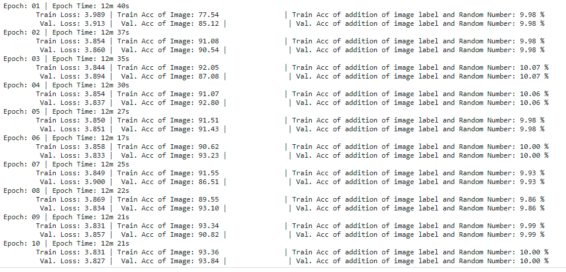

## Neural network model in Pytorch

### Asignment 3

1. Write a neural network that can:
	1.Take 2 inputs:
		1.an image from MNIST dataset, and
		2.a random number between 0 and 9
	2.and gives two outputs:
		1.the "number" that was represented by the MNIST image, and
		2.the "sum" of this number with the random number that was generated and sent as the input to the network
	
	
	    
	3.you can mix fully connected layers and convolution layers
	4.you can use one-hot encoding to represent the random number input as well as the "summed" output. 

### Following approuch is used to build a neural network  

#### Data Gerenation and Represntation strategy

1. Considered MNIST dataset images as one of the input the model

2. For the random numbder data, generated a Dataframe with two columns
	1. input = Numbers from 0 to 9
	2. output = Possible outcomes thats possible from summing up random numbers from 0 to 9 with MNIST data labels 0 to 9 
	3. Repeating this sample to 600 times to match the MNIST dataset length
	4. Custom data generation class is written to combine image and random numbder data by extending pytorch's Dataset class
	  * The random data set's input is converted into one hot encoding tensor
	  * This class returns the two inputs, image and random number (in one hot format) and two outputs, image label and summed output 

#### Building neural network here
The network consists of 2 conv2d layers, 4 linear layers 

	1. The image is passed as a first input to network with consists of 2 conv2d layers followed by one linear layer with approriate activation function at each layer
	2. The random number passed as second input linear with layer with approriate activation function at each layer
	3. First and second inputs are combined using torch.cat function 
	4. Concatenated input is sent to 3rd liner layer followed by softmax activation function to get first output
	5. The same  concatenated input is sent to 4th liner layer followed by softmax activation function to get second output
	6. Finally two outputs, image label and summed output are returned from the network

#### Generate train and test loaders by SubsetRandomSampler
	1. Data is split into 80% train and 20% test 
	2. Model data is trained using training set and its perfomance is evaluated on test 
	3. Cross entropy is used as loss function for both the output, because we are solving a classification problem and The purpose of the Cross-Entropy is to take the output probabilities (P) and measure the distance from the truth values
	4. Based on loss and accuracy model perfomance is evaluated 

Traing log screen shot attched here 

