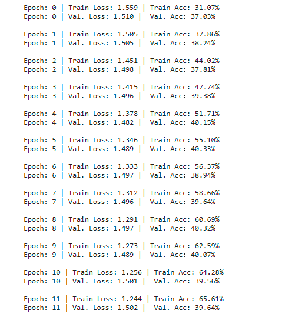
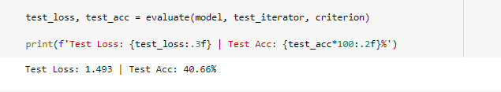
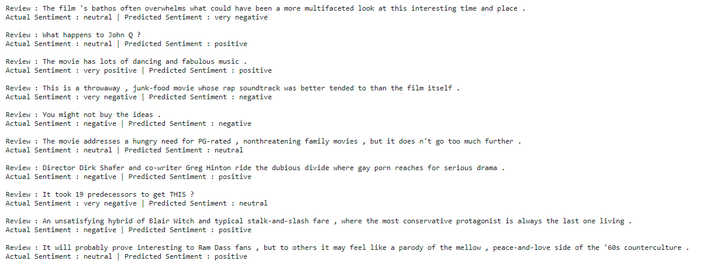

## Building Sentiment Classifier using LSTM

### Data Overview 

StanfordSentimentAnalysis Dataset is considered to build the LSTM Model 

Based on Readme	 file given by StandordSentiment Treebank, following way sentence and sentiment labels are mapped

	1. datasetSentences.txt contains sentence and corresponding index
	2. datasetSplit contains the sentence index and splitset label. Splitset labels 1,2,3 corresponds to tarin, test and dev respectively
	3. datasetSentences and datasetSplit merged based on sentence index. let's call it as merged_dataset
	4. sentiment_labels contains phrase id and sentiment values ranging from 0 to 1. Here notice that there is no one to mapping between datasetSentences and sentiment_labels
	5. dictionary.txt contains all phrases and their IDs
	6. Now, perfom left join on merged_dataset and dictionary using sentence and phrases
	7. As we have phrase id, again perform left join on previous dataset (obtained from step #6) and sentiment_labels using phrase_id and phrase id
	8. Here we get a final table with sentiment values
	9. Divide the sentiment values into 5 buckets [0, 0.2], (0.2, 0.4], (0.4, 0.6], (0.6, 0.8], (0.8, 1.0] and assign a label from 0 to 4
	10. Finally, use a split label to devide your data into train,test and dev 

### Data Augmentation

Following augmentation techniques are performed:

**Back Translation**

Intially this technique is tried for all the sentences in the training data set. It look lot of time but did not convert more than few sentences so for the demonstartion purpose the below mentioned approuch is used

Due to following limitations of the package only a random smaple of 10 sentences (why 10 just randonly chosen) are taken and performed this augmentation. Germen language is chosen here (one can choose multiple langauges too)

	1. The maximum character limit on a single text is 15k.
	2. Due to limitations of the web version of google translate, this API does not guarantee that the library would work properly at all times
	   If there is time, probably back transaltion can be done on entire training set by passing sentences in multiple batches on different days/time

**Radom swap**

The random swap augmentation takes a sentence and then swaps words within it n times, with each iteration working on the previously swapped sentence. Here we sample two random numbers based on the length of the sentence, and then just keep swapping until we hit n.

	1. This function takes words list as one of the arguments. So sentences are splits based on spaces and passed 
	2. Function returns the randomly swapped words in a list later is combined as a sentence
	
**Random Deletion**

As the name suggests, random deletion deletes words from a sentence. Given a probability parameter p, it will go through the sentence and decide whether to delete a word or not based on that random probability. 

	1. This function takes words list as one of the arguments. So sentences are splits based on spaces and passed 
	2. Function returns the randomly deleted words in a list later is combined as a sentence
	
Note that, all the three methods are applied only on training data set separately and combined as a single data set 

### Building vocabulary and spitting dataset

Built a vocabulary on reviews and lables and for reviews using pretrained glove emmbeddings

Data set is split into train valid and test set with 70%,10% and 20% respectively and passed to bucket iterator

### Model Architecture 

1. First words in the reviews are sent to emmbeddings layer with 100 hidden dimention
2. It is then fed into a 2 stacked-LSTMs with 256 hidden features with a drop out function
3. Later output of LSTM is fed to fully connected layer with 5 output

Total Trainable parameters

classifier(
  (embedding): Embedding(17214, 300, padding_idx=1)
  (encoder): LSTM(300, 256, num_layers=2, batch_first=True, dropout=0.5, bidirectional=True)
  (dropout): Dropout(p=0.5, inplace=False)
  (fc): Linear(in_features=512, out_features=5, bias=True)
	)
	The model has 7,886,509 trainable parameters 
	
### Hyper parameters

| Parameter Name | Value |
|----------------|:-----:|
| Embedding DIM  | 300   |
| HIDDEN DIM     | 256	 |
| NUM LAYERS     |2		 |
| DROUP OUT      |0.5	 |
| BATCH SIZE     |64     |
| LR             |1.e-3  |

### Training logs

**Model is trained for 30 epochs**

It is noticed that the model stopped learning after 9th epoch.

I trained model with different the hyperparameters combinations. However could only obtain 40% accuracy on validation set

**Model Evaluation result on test set** 

**Validation of the model by passing the reviews and observing it's outcome**

