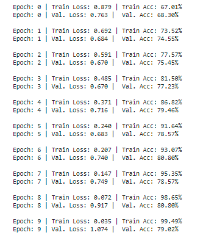
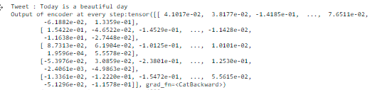
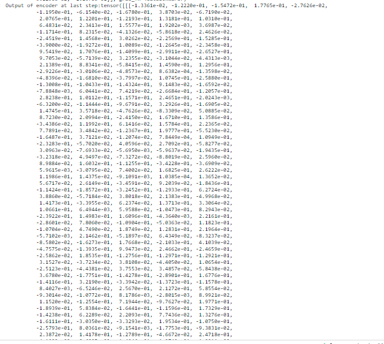
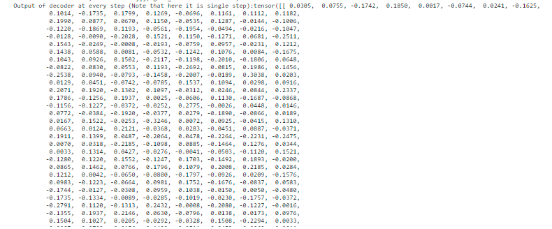

### Building Tweet Sentiment Classifier using Encoder Decoder Architecture 

### Data Overview 

Tweet data set consist of around 1k tweets labeled with either positive, negative and neutral sentiment

Distribution of lables 

|lables | Counts |
|-------|:------:|
|0:Negative| 931 |
|1:Positive| 352 |
|2:Neutral | 81  |

### Defining fields, building vocab and define bucket iterator

1. Tweet data set is converted into torch dataset by using torch data fields, one for tweets and another for labels
2. Torch Dataset is used to split the data into train and test sets
3. Vocb is built on the both Tweet and lables fields by passing desired max_size. Passing max_size parameter is necessary when we don't have enough GPUs to train the large model
3. The train and test dataset are passed bucket iterator to group the simliar length text together

### Model Architecture

The architecture is written by defining 3 classes namely Encoder, Decoder and EncoderDecoder

**Encoder class**

Encoder class contains two definitions 

1. Init -
	Contains the input,hidden,emmbedding dimenstions along with number of layers parameters and expects the values to be given while calling the encoder class
	Here is the place we also define required modules from nn.Module 

2. Forward function -
	Takes the input text and text lengths as an argument
						  | 
	The input text passed to emmbedding layer to get emmbedding
						  | 
	These emmbeddings are passed to LSTM layer 
						  | 
	Returns the hidden and cell states
	
**Decoder class**

Decoder class contains two definitions 

1. Init -
	Contains the output,hidden, dimenstions along with number of layers parameters and expects the values to be given while calling the encoder class
	Here is the place we also define required modules from nn.Module 
	
2. Forward Function -
    Takes the input,hidden,cell parameter  : Note that in this case hidden state itself is passed as input
							|
	There is emmbedding layers here, the above parameters are passed to LSTM layer
	                        |
	The hidden state from last cell of LSTM layer  is passed to fully connected layer to get final prediction
							|
	Returns final predictions along with hidden and cell state of LSTM layer
	
**EncoderDecoder class**

In this calss encoder and decoder class are combined in the following way:

1. Encoder and Decoder classes are intiliazed in the init function
2. In the forward function of this class, encoder forward class is called by passing text and text lenght
3. Output from encoder class is passed decoder forward class
4. Output (final prediction) from the decoder class is returned

### Training logs

**Model is trained for 10 epochs**

Can see model is starts overfitting after 5th epochs

### One of the other asks was to take one sentence, "print the outputs" of the encoder for each step and "print the outputs" for each step of the decoder. 

This is how I could think of printing. I am sure there is a better way of priniting these outputs

What I understand is nn.LSTM returns 3 things :- 1. outputs 2. hidden 3. cell

The outputs is where hidden state of each time step is captured. So I added a print statement in the Encoder class to print the outputs of the encoder for each step

And to "print the outputs" for each step of the decoder, added the print statement to print the hidden state return nn.LSTM in the decoder class 

Example of same is attached here :

	
	
### Things to try

1. n_layers from 1 to more and add dropout layer to aviod overfitting

2. Use glove emmbedding while creating vocab

3. Perfom bi-directional training in LSTM

4. Replce LSTM by GRU and see the performance

