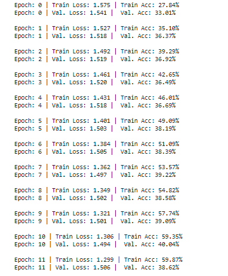
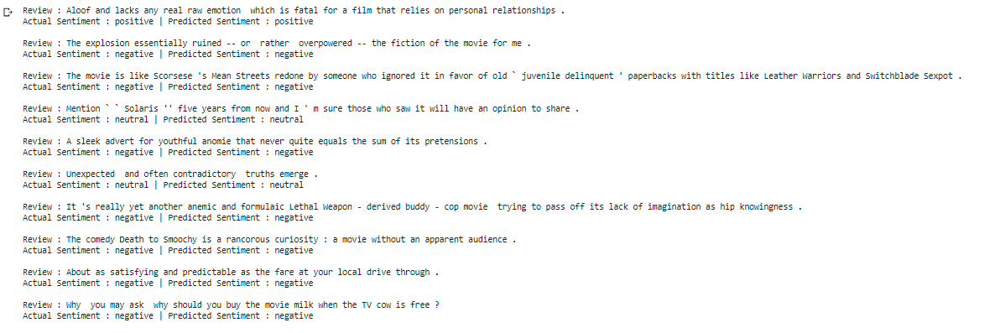
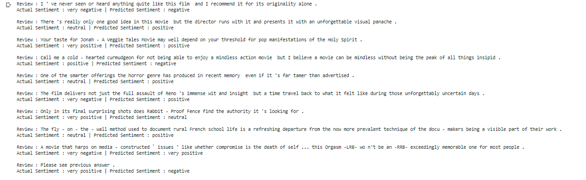

## Building Sentiment Classifier using LSTM

### Data Overview 

StanfordSentimentAnalysis Dataset is considered to build the LSTM Model 

Based on Readme	 file given by StandordSentiment Treebank, following way sentence and sentiment labels are mapped

	1. datasetSentences.txt contains sentence and corresponding index
	2. sentiment_labels contains phrase id and sentiment values ranging from 0 to 1. Here notice that there is no one to mapping between datasetSentences and sentiment_labels
	5. dictionary.txt contains all phrases and their IDs
	6. Now, perfom  left join on datasetSentences and dictionary using sentence and phrases
	7. As we have phrase id, again perform left join on previous dataset (obtained from step #6) and sentiment_labels using phrase_id and phrase id
	8. Here we get a final table with sentiment values
	9. Divide the sentiment values into 5 buckets [0, 0.2], (0.2, 0.4], (0.4, 0.6], (0.6, 0.8], (0.8, 1.0] and assign a label from 0 to 4
	10.Finally, split dataset into train and test set  

### Building vocabulary and spitting dataset

Built a vocabulary on reviews and lables and for reviews using pretrained glove emmbeddings

Data set is split into train and test set with 70%,30% respectively and passed to bucket iterator

### Model Architecture 

1. First words in the reviews are sent to emmbeddings layer with 100 hidden dimention
2. It is then fed into a 2 stacked-LSTMs with 256 hidden features with a drop out function
3. Later output of LSTM is fed to fully connected layer with 5 output

Total Trainable parameters

classifier(
  (embedding): Embedding(17071, 300, padding_idx=1)
  (encoder): LSTM(300, 256, num_layers=2, batch_first=True, dropout=0.5, bidirectional=True)
  (dropout): Dropout(p=0.5, inplace=False)
  (fc): Linear(in_features=512, out_features=5, bias=True)
)
	The model has 7,843,609 trainable parameters 
	
### Hyper parameters

| Parameter Name | Value |
|----------------|:-----:|
| Embedding DIM  | 300   |
| HIDDEN DIM     | 256	 |
| NUM LAYERS     |2		 |
| DROUP OUT      |0.5	 |
| BATCH SIZE     |64     |
| LR             |1.e-3  |

### Training logs

**Model is trained for 30 epochs**

It is noticed that the model stopped learning after 11th epoch.

**Validation of the model by passing the reviews and observing it's outcome**

**Sample of corretly classified reviews**

**Sample of miss classified reviews**

