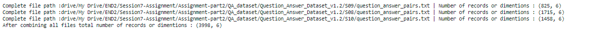
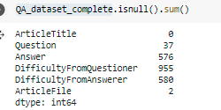
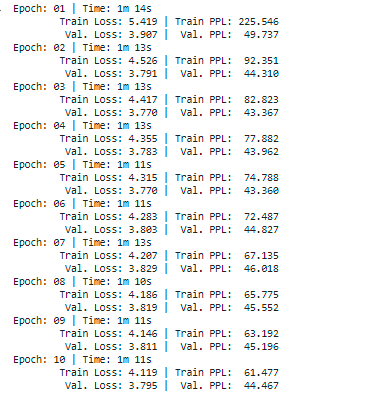
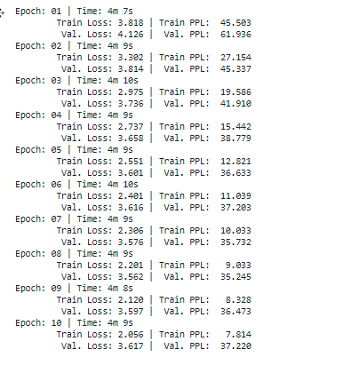

## Building Question Answer Model using Seq2seq Architecture

### Data Overview 

The Question/Answer dataset generated by students who took undergraduate natural language processing courses taught by Noah Smith 
at Carnegie Mellon and Rebecca Hwa at the University of Pittsburgh during 
Spring 2008, Spring 2009, and Spring 2010.

There are three directories, one for each year of students: S08, S09, and S10 and each of the folder have question_answer_pairs.txt file

This data set can be downloaded from http://www.cs.cmu.edu/~ark/QA-data/

These file contains the totaly 6 columns out of which question and answer are our point of interset

Also note that, there are frequently multiple lines with the same question, which appear if those questions were answered 
by multiple individuals. So duplicate questions should be retained

*Data summary*

There are in total 3998 question and answer pairs. It's observed that there are nulls in the question and answer pairs

Assuming that there can not be nulls in questions and answers, such records are dropped from the data set.

After removing nulls, we are left with 2733 question and answer pairs.

### Defining fields, building vocab and define bucket iterator

1. Question and Answer data set is converted into torch dataset by using torch data fields, one for question and another for answer
2. Torch Dataset is used to split the data into 70% train and 30% test sets
3. Vocb is built on the both Question and Answer fields 
3. The train and test dataset are passed to bucket iterator to group the simliar length text together

### Training logs

--------------------------------------------------------------------------------------------------------------------

## Building Similar question generator Model using Seq2seq Architecture

## Data Preview : 

An important product principle for Quora is that there should be a single question page for each logically distinct question. As a simple example, the queries “What is the most populous state in the USA?” and “Which state in the United States has the most people?” should not exist separately on Quora because the intent behind both is identical. Having a canonical page for each logically distinct query makes knowledge-sharing more efficient in many ways: for example, knowledge seekers can access all the answers to a question in a single location, and writers can reach a larger readership than if that audience was divided amongst several pages.

The data released by quora conatins set of questions with alternative ways of asking the same questions along with tag which says wheather question is a duplicated question or not

The dataset is downloaded from http://qim.fs.quoracdn.net/quora_duplicate_questions.tsv

Data set contains 6 columns out of which question1,question2 and is_duplicate fields are our interset. Only rows with is_duplicate =1 is considered

*Data summary*

There are in total 149263 questions and simliar questions pairs exists after selecting only duplicated pairs

### Defining fields, building vocab and define bucket iterator

1. Duplicate questions data set is converted into torch dataset by using torch data fields, one for question1 and another for question2
2. Torch Dataset is used to split the data into 70% train and 30% test sets
3. Vocb is built on the both question1 and question2 fields 
3. The train and test dataset are passed to bucket iterator to group the simliar length text together

### Training logs

